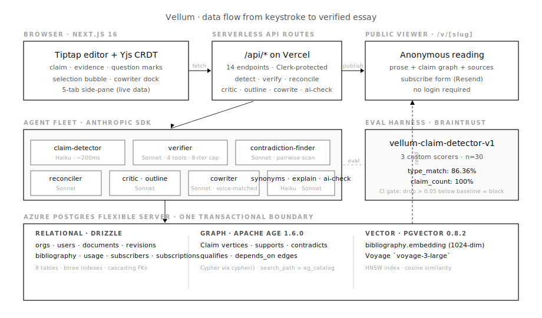

# Penstroke

> A graph-of-claims word processor for essayists, journalists, and researchers.

[](https://github.com/mariaangelikabuilds/vellum/actions/workflows/eval.yml)


*Demo URL pending v1 deploy. Source on this repo. Build log at [`docs/build-log.md`](./docs/build-log.md).*

---

## What it is

Most AI writing tools polish prose. Penstroke sees the *structure* of an argument.

As you write, every sentence with a claim becomes a node in a typed graph. Every citation becomes an edge. A background agent fleet checks each claim against your bibliography and the open web — flagging unsupported assertions, contradictions across paragraphs, and missing premises before you ship.

The export is prose. The underlying structure is queryable.

## In ~30 seconds

1. **Type prose.** Marks (claims) appear underlined in the editor as Haiku detects them.
2. **Side-pane fills** with a typed graph: factual / opinion / speculation / evidence / question.
3. **Click "scan for contradictions."** Sonnet finds claim pairs that conflict; an amber ribbon appears.
4. **Click "reconcile."** Sonnet drafts a unified rewrite. Accept, reject, or copy.
5. **Hit "publish."** A reader-facing page appears at `/v/[slug]` with the full claim graph attached.
6. **Hit "broadcast."** Subscribers receive the essay as email via Resend.

There are also four selection-driven craft tools: **synonyms** (context-aware), **explain** (plain-reading of a phrase), **voice check** (does this still read as you?), and **continue** (Sonnet drafts the next paragraph in your voice — never inventing facts).

## Audience

- **Researchers + grad students** — every paper is claim-citation-tracking work
- **Journalists** — fact-grounding before publication is your professional liability
- **Essayists / public writers** — differentiate from AI slop with a verifiability layer
- **Anyone reading critically** — paste any URL and get the argument graph (reader mode, v1.5)

## Architecture, briefly



- **Yjs CRDT + custom Tiptap/ProseMirror schema** — prose document and claim graph stay in sync via a deterministic projection. Mergeable both directions.
- **Apache AGE on Postgres** — graph traversals + relational queries + pgvector retrieval in one database. Single transactional consistency boundary; no cross-DB sync.
- **Two-tier model routing** — Haiku 4.5 for sub-200ms claim-detection (high frequency), Sonnet 4.6 for high-stakes verification with tool use (low frequency). Cost-disciplined.
- **Eval-gated deploys** — Braintrust nightly regression on claim-detection + contradiction-detection. CI blocks deploys that drop more than 0.05 below baseline.
- **Background verification via Trigger.dev v4** — verification doesn't block the request path; UI fetches updates as agents finish.

Full architecture writeup: [`docs/decisions.md`](./docs/decisions.md). Build log: [`docs/build-log.md`](./docs/build-log.md).

## Eval scores (live)

Latest run, n=30 hand-labeled paragraphs covering factual / opinion / speculation / evidence / question:

| Metric | Score | Threshold |
|---|---|---|
| `claim_count_match` | **100.00%** | — |
| `type_match` | **86.36%** | ≥ 0.85 ✓ |
| `confidence_above_min` | **77.27%** | — |
| `errors` | 8 / 30 | concurrency saturation, transient |

Full Braintrust dashboard linked from CI runs. Eval task: [`vellum-app/evals/tasks/claim-detector.eval.ts`](./vellum-app/evals/tasks/claim-detector.eval.ts). Gold set: [`vellum-app/evals/datasets/claim-detection.jsonl`](./vellum-app/evals/datasets/claim-detection.jsonl) (~30 entries; growing as failures surface).

## Tech stack

| Layer | Choice |
|---|---|
| Frontend | Next.js 16 (App Router) + React 19 + TypeScript strict + Tailwind v4 |
| Editor | Tiptap v3 (ProseMirror) with custom claim/evidence/question marks + BubbleMenu |
| Realtime | Yjs (in-memory v1; WebSocket relay deferred to v2) |
| Backend | Next.js API routes + Trigger.dev v4 for durable workflows |
| Database | Azure Postgres Flexible Server (B1ms) + Apache AGE 1.6.0 + pgvector 0.8.2 |
| AI | Anthropic SDK · Claude Sonnet 4.6 + Haiku 4.5 + Voyage `voyage-3-large` + Exa `type:auto` |
| Evals | Braintrust + autoevals |
| Auth + billing | Clerk org mode + Stripe (test mode; full billing v2) |
| Observability | Sentry · Langfuse · Braintrust |
| Email | Resend (newsletter publishing) |
| Hosting | Vercel (app) — deploy pending v1 ship |
| Typography | Newsreader serif (body) + Libre Franklin (chrome) — both free, NYT pairing |

## What's *intentionally* not in v1

- **Live multi-user collab UX.** Yjs is wired but no presence cursors. Co-authoring is v2.
- **Stripe billing checkout.** Schema + test-mode key are present but no products, no checkout flow. v2 ships paid tiers.
- **WebSocket relay.** No Cloudflare Worker yet. Yjs runs in-memory only; persistence happens via debounced `proseText` save, not Yjs binary.
- **Mobile editor.** "Best on desktop" notice on phones/tablets. Reading mode (`/v/[slug]`) is mobile-good. Mobile authoring is v2.
- **Public Penstroke API with rate limiting / auth keys.** A read-only `/api/v1/essays/[id]` exists for published docs; multi-tenant API keys are v2.

This list matters as much as the feature list. Scope discipline = senior signal.

## Build it yourself

The literal end-to-end build (every command, every file, every config) is in [`BUILD.md`](./BUILD.md). Estimated time: ~5 weeks of focused build interleaved with other work.

```bash
cd vellum-app
pnpm install
cp .env.example .env.local
# fill in: ANTHROPIC_API_KEY, DATABASE_URL, CLERK_*, etc.

pnpm tsx scripts/setup-age.ts        # CREATE EXTENSION age + create_graph
pnpm tsx scripts/test-pgvector.ts    # CREATE EXTENSION vector
pnpm tsx scripts/migrate.ts          # apply Drizzle migrations
pnpm tsx scripts/post-migrate.ts     # HNSW index on bibliography.embedding
pnpm db:seed                         # 1 org / 1 user / 1 doc + 2 marks

pnpm dev                             # http://localhost:3000
```

## How this was built

Penstroke was built solo with **Claude Code as pair-programmer**:

- **Architectural decisions** (Neon → Azure for AGE, Yjs vs OT, two-tier routing, no-AI design register) — author's calls.
- **Boilerplate + repetitive refactors + agent scaffolding + Drizzle table writeups** — delegated to Claude Code.
- **Hard parts** (AGE Cypher integration via Drizzle, Tiptap mark application, font system, scroll architecture) — iterated in agent-pair-programming sessions.

Velocity: roughly 3-person-team scope shipped solo in one focused build week. The 60+ commit log on this repo is the primary-source receipt; daily detail in [`docs/build-log.md`](./docs/build-log.md).

## Status

- [x] **v0** — repo scaffolded · BUILD.md · case-study skeleton
- [x] **v0.5** — toolchain + 13 service accounts + database (Azure + AGE + pgvector) + auth + agent fleet + frontend
- [x] **v1.0 functional** — single-user multi-tenant ready, all 6 agents wired, eval-gated, public viewer, newsletter
- [ ] **v1.0 ship** — Vercel deploy, custom domain, Sentry source maps, public scores dashboard
- [ ] **v1.5** — argument map force-graph, browser extension, version history, mobile reader
- [ ] **v2** — multi-user collab, Stripe billing, public API w/ keys + rate limits

Track progress: [`docs/build-log.md`](./docs/build-log.md). Decision rationales: [`docs/decisions.md`](./docs/decisions.md).

## Contact

- **Author:** Angel Agutaya — [LinkedIn](https://www.linkedin.com/in/angeleliseagutaya) · [GitHub](https://github.com/mariaangelikabuilds)
- **Issues:** [GitHub Issues](https://github.com/mariaangelikabuilds/vellum/issues)

## License

MIT for the typed-claim ontology. App code source-available, license TBD.

## Acknowledgments

- **Clearbrief** for proving the claim-graph model in legal.
- **Tiptap** for saving ~3 weeks of ProseMirror scaffolding.
- **Yjs**, **Apache AGE**, **Trigger.dev**, **Braintrust**, **Anthropic**, **Azure**, **Clerk**, **Vercel**, **Cloudflare** for the stack that made this shippable solo.
